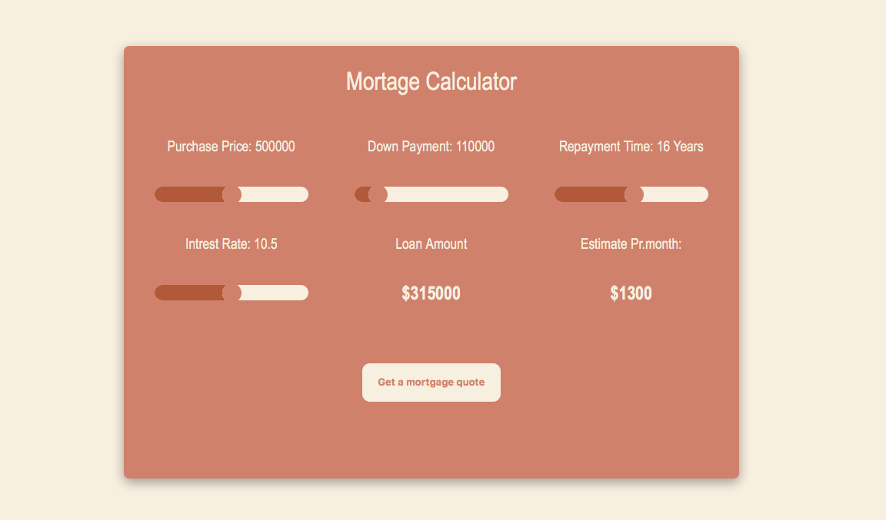

# DevProjects - Mortgage calculator web app

This is an open source project from [DevProjects](http://www.codementor.io/projects). Feedback and questions are welcome!
Find the project requirements here: [Mortgage calculator web app](https://www.codementor.io/projects/web/mortgage-calculator-web-app-d16bqrq2q3)

## Tech/framework used
Built with ___
HTML 
SCSS
Java Script

## Screenshots and demo

## Installation
Instructions for other developers on how to install and run your code on their local environment.

## License
[MIT](https://choosealicense.com/licenses/mit/)
Most open source projects use the MIT license. Feel free to choose whichever license you prefer.

